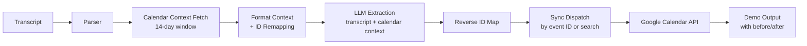

# Intelligent CRUD: Calendar-Aware Event Extraction

## Overview

Enhance the LLM extraction pipeline to make intelligent create/update/delete decisions by injecting existing Google Calendar events into the prompt context. Currently the AI defaults to "create" blindly. After this epic, the AI sees the owner's upcoming 14-day calendar, matches conversation references to real events, and outputs the correct CRUD action with reasoning.

## Architecture — Data Flow (Enhanced)



**New components** (bold = new, italic = modified):
- **Calendar context fetcher** — fetches 14-day window via existing `list_events()`
- **Context formatter + ID remapper** — converts events to compact prompt format, maps UUIDs to short integers (50% error rate with UUIDs vs 5% with integers per BAML research)
- *Enhanced system prompt* — CRUD decision rules, few-shot examples, negative examples, calendar context section
- *LLM response schema* — adds `existing_event_id` field, migrates from "none" sentinels to proper `Optional`
- *Pipeline* — fetches calendar context before LLM call, passes to extractor, index-based event correlation
- *Sync dispatch* — direct event-ID API calls when available, fallback on 404 (update→create, delete→skip)
- *Demo output* — shows matched event info and before/after for updates

## Approach

### Phase 1: Schema & Infrastructure (Tasks 1-2)
Update data models with `existing_event_id`, migrate sentinel pattern, build calendar context fetcher with ID remapping.

### Phase 2: Prompt Engineering (Task 3)
Rewrite system prompt with CRUD decision rules, few-shot examples, negative examples, calendar context injection format, and "last statement wins" instructions.

### Phase 3: Pipeline Wiring (Tasks 4-5)
Integrate context fetch before LLM call, update extract_events() to accept calendar context, rewire sync dispatch for event-ID-based operations with fallback.

### Phase 4: Output & Tests (Tasks 6-7)
Enhanced demo output with update/delete context, new sample transcripts, integration tests, documentation updates.

## Key Design Decisions

1. **ID remapping** (practice-scout finding): Remap Google Calendar event IDs (long UUIDs) to short integers (1, 2, 3...) before prompt injection. Reverse-map after LLM response. UUIDs cause ~50% LLM error rates vs ~5% with integers. Remapping table lives as a dict created during context formatting, passed through pipeline to sync dispatch.

2. **Calendar context placement**: Inject in the user prompt after the transcript (practice-scout: content at end gets more attention due to recency). Format: compact structured text with `ID | Title | Start | End | Location`.

3. **Direct-ID + fallback sync**: When `existing_event_id` is present, call `update_event(id)` / `delete_event(id)` directly. On `CalendarNotFoundError`: update→fallback to create, delete→skip with warning. When no ID, fall back to existing search-based methods.

4. **Index-based event correlation**: Replace fragile `{title: validated_event}` mapping in pipeline with index-based correlation between `ExtractedEvent` and `ValidatedEvent` lists.

5. **Migrate sentinel pattern**: SDK v1.63.0 supports `Optional[str] = None` natively. Drop the "none" sentinel pattern from `LLMResponseEvent` and the `_convert_event()` conversion logic. This is a natural cleanup while already modifying the schema.

6. **Dry-run calendar context**: Fetch calendar context even in dry-run mode if credentials are available (LLM needs real context for accurate CRUD decisions). If credentials unavailable, degrade gracefully to no-context mode.

7. **Asymmetric confidence in prompt**: Instruct the LLM via prompt engineering to use "high" confidence for updates/deletes only when a clear match exists. No hard confidence filtering in Python — trust LLM + validate at sync time.

8. **Alphabetical key ordering**: Gemini sorts response schema keys alphabetically. Ensure `reasoning` field is generated before `action` for better CoT. Current alphabetical order: `action` < `assumptions` < `attendees` < `confidence` < `end_time` < `existing_event_id` < `location` < `reasoning` < `start_time` < `title`. This puts `reasoning` after `existing_event_id` which is acceptable — the LLM reasons about the match before providing the action.

## Risks & Mitigations

| Risk | Likelihood | Impact | Mitigation |
|------|-----------|--------|------------|
| LLM hallucinating event IDs | Medium | High | Integer remapping (5% vs 50% error rate), validate returned ID against context set |
| Wrong event matched for update/delete | Medium | High | Require reasoning justification in prompt, log match reasoning at INFO |
| Calendar API unavailable for context | Low | Medium | Graceful degradation to no-context mode (current behavior) |
| Token budget with busy calendars | Low | Low | 100 events ≈ 5K tokens, 1M context window, not a concern |
| Model deprecation mid-epic | Medium | Medium | Using gemini-3-flash-preview which is the forward-looking model |
| Breaking existing tests | High | Medium | Each task includes updating affected tests |

## Alternatives Considered

1. **Two-pass LLM approach** (classify action first, then extract details): Rejected — adds latency and cost for marginal accuracy improvement. Single-pass with structured output + calendar context is sufficient for demo scope.

2. **Hard confidence filtering in Python**: Rejected — asymmetric thresholds add complexity. Better to prompt-engineer the LLM to output appropriate confidence and validate at sync time.

3. **Search-based matching only (no event IDs)**: Rejected — the AI can explicitly name which event it's targeting when given context with IDs. Direct-ID calls are more reliable than post-hoc fuzzy search.

## Non-Functional Targets

- Pipeline latency increase: <2s for calendar context fetch (single API call, paginated)
- Token overhead: <2K tokens for typical calendar context (20 events)
- No regression in existing 258 tests
- Maintain ≥90% code coverage

## Quick Commands

```bash
# Run all tests
python3 -m pytest --tb=short -q

# Run only fn-6 related tests
python3 -m pytest tests/unit/test_prompts.py tests/unit/test_pipeline.py tests/unit/calendar/test_context.py -v

# Lint check
python3 -m ruff check .

# Dry-run with sample
python3 -m cal_ai --dry-run samples/simple_lunch.txt
```

## Acceptance

- [ ] AI correctly identifies UPDATE actions from conversational cues (reschedule, move, change time)
- [ ] AI correctly identifies DELETE actions from both explicit and implicit cancellation language
- [ ] Existing calendar events (14-day window) are injected into the LLM prompt with remapped integer IDs
- [ ] AI references specific existing event IDs when proposing updates/deletes
- [ ] AI states what changed vs original in reasoning for updates
- [ ] Last-statement-wins: conflicting instructions produce single final event
- [ ] No-match fallback: update without match → create, delete without match → skip with warning
- [ ] Calendar context fetch failure degrades gracefully (falls back to current behavior)
- [ ] Demo output shows update/delete operations with matched event info
- [ ] Sentinel pattern migrated to proper Optional fields
- [ ] All existing tests continue to pass (no regressions)
- [ ] CLAUDE.md and SPEC.md updated

## References

- Practice-scout: BAML UUID remapping research (50% vs 5% error rates)
- Practice-scout: Gemini alphabetical key sorting in response_schema
- Practice-scout: Lost-in-the-middle effect — place context near end of prompt
- Docs-scout: SDK v1.63.0 supports Optional natively, 1M token context
- GitHub-scout: speakr repo (2.8K stars) — negative examples, qualifying criteria
- GitHub-scout: chakrateja70 chatbot — cleanest CRUD classification prompt pattern
- Context-scout: Full CRUD plumbing already exists end-to-end
- Epic-scout: Depends on fn-3, fn-4, fn-5 (all complete)
