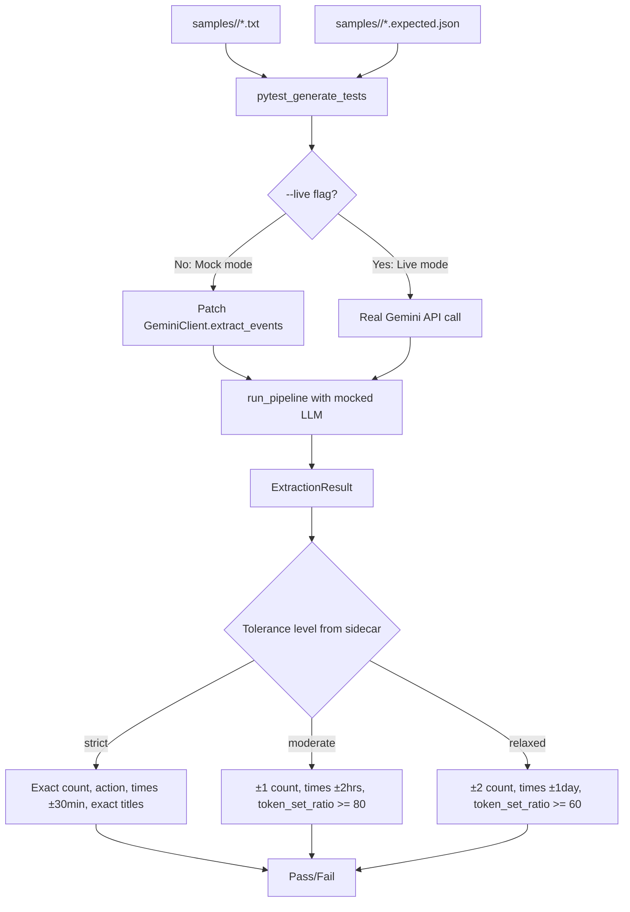

# Comprehensive Regression Test Suite: 40+ Stress-Test Samples

## Overview

Build a comprehensive regression test suite for the AI extraction pipeline with 40+ sample transcripts across 5 scenario categories, each paired with a sidecar `.expected.json` file. The suite supports mock mode (default, deterministic) and live mode (`--live` flag, real Gemini API). Assertions use a three-tier tolerance system (strict/moderate/relaxed) per sample.

## Scope

**In scope:**
- Migrate existing 11 samples to new `samples/<category>/` subdirectory structure
- Update all hardcoded `samples/` references (Dockerfile, docker-compose, 5+ test files, README, CLAUDE.md)
- Build sidecar JSON schema with Pydantic model + loader utility
- Build tolerance assertion engine (strict/moderate/relaxed) with `rapidfuzz` for fuzzy title matching
- Create `tests/regression/` infrastructure: conftest.py, pytest_generate_tests, --live flag, parametrized tests
- Write 40+ new sample transcripts with sidecar `.expected.json` files across all 5 categories
- Add `rapidfuzz` dev dependency
- Register `live` marker in pyproject.toml, add Makefile targets
- Update docs (README, CLAUDE.md, Makefile)

**Out of scope:**
- Benchmarking/scoring (fn-8-vyv)
- Precision/recall metrics
- AI-generated reports
- New pipeline features

## Architecture & Data Flow



## Key Design Decisions (from gap analysis)

1. **Mock response mechanism**: Sidecar JSON contains a `mock_llm_response` field with the raw JSON the LLM would return. Mock patches `GeminiClient._client.models.generate_content` to return this JSON (same layer as `test_llm.py:L51-63`). This tests LLM response parsing, not just extraction.

2. **Mock intercept layer**: Patch at `genai.Client.models.generate_content` (like `_mock_client()` in `test_llm.py`), NOT at `extract_events()`. This exercises the JSON parsing and validation pipeline.

3. **Sidecar schema additions** (beyond original spec):
   - `owner`: Owner name for the pipeline (default: "Alice")
   - `reference_datetime`: ISO 8601 frozen datetime for relative time resolution (default: "2026-02-20T10:00:00")
   - `mock_llm_response`: Raw JSON string the mocked LLM returns
   - Remove `expected_event_count` (derive from `len(expected_events)`)

4. **Event matching**: Use best-match (not positional). Match actual events to expected events by minimizing total distance across (action, title, start_time). This avoids false failures from reordering.

5. **Existing sample categorization**:
   - `crud/`: simple_lunch, update_meeting, cancel_event, cancellation, mixed_crud, clear_schedule
   - `multi_speaker/`: complex, multiple_events
   - `adversarial/`: no_events
   - `realistic/`: ambiguous_time
   - Delete `multiple_events_copy.txt` (orphan duplicate)

6. **Tolerance defaults**: If sidecar omits `tolerance`, default to `moderate`. For delete actions, time tolerance applies to the referenced event time (from calendar_context), not a new event time.

7. **Live mode**: Uses same tolerance as sidecar. No automatic relaxation. Rate limiting handled by existing Gemini SDK retry logic.

8. **Dockerfile CMD**: Updated to `CMD ["samples/crud/simple_lunch.txt"]`.

## Risks & Mitigations

| Risk | Impact | Mitigation |
|------|--------|------------|
| Tolerance thresholds too tight/loose | Flaky or meaningless tests | Start with moderate defaults, tune after first live run |
| Gemini SDK uses gRPC (breaks VCR) | Mock mode fails | Mock at application layer, not HTTP |
| 40+ samples = large test collection | Slow CI | Mock mode is fast (<1s/test); long samples marked `@pytest.mark.slow` |
| Non-deterministic LLM output | Live tests flaky | Use `temperature=0` in live mode; tolerance absorbs variance |
| Breaking existing tests during migration | Regression | Migrate + update refs atomically in one task; run full suite after |
| fn-8 depends on sidecar schema | Schema lock-in | Finalize schema in Task 2 before writing samples |

## Quick commands

```bash
# Run all tests including regression (mock mode)
make test

# Run only regression suite (mock mode)
pytest tests/regression/ -v

# Run regression suite with live Gemini API
pytest tests/regression/ --live -v

# Run only CRUD category
pytest tests/regression/ -k crud -v

# Skip long/slow regression tests
pytest tests/regression/ -m "not slow" -v
```

## Acceptance

- [ ] 40+ sample transcripts across all 5 categories (at least 5 per category)
- [ ] Even spread of conversation lengths (short, medium, long, very long)
- [ ] Each sample has a sidecar .expected.json with tolerance, calendar context, expected events, and mock_llm_response
- [ ] Existing 11 samples migrated to new subdirectory structure with sidecars
- [ ] All hardcoded references updated (Dockerfile, docker-compose, 5+ test files, README, CLAUDE.md)
- [ ] Tolerance assertion engine with strict/moderate/relaxed levels using rapidfuzz
- [ ] Regression test runner auto-discovers samples via pytest_generate_tests
- [ ] Mock mode (default) patches generate_content with pre-recorded response
- [ ] Live mode via --live flag with @pytest.mark.live marker
- [ ] Event matching uses best-match algorithm (not positional)
- [ ] All existing tests still pass after migration
- [ ] ruff clean
- [ ] New Makefile targets: test-regression, test-regression-live

## References

- Existing mock pattern: `tests/unit/test_llm.py:51-63` (`_mock_client()`)
- Existing E2E pattern: `tests/integration/test_crud_flows.py:86-169` (`_run_crud_e2e()`)
- Pipeline entry: `src/cal_ai/pipeline.py:116` (`run_pipeline()`)
- Extraction models: `src/cal_ai/models/extraction.py` (`ExtractedEvent`, `ExtractionResult`)
- Calendar context: `src/cal_ai/calendar/context.py` (`CalendarContext`)
- Prompt injection: `src/cal_ai/prompts.py:265-274`
- pytest parametrize docs: https://docs.pytest.org/en/stable/how-to/parametrize.html
- rapidfuzz: https://github.com/rapidfuzz/RapidFuzz
