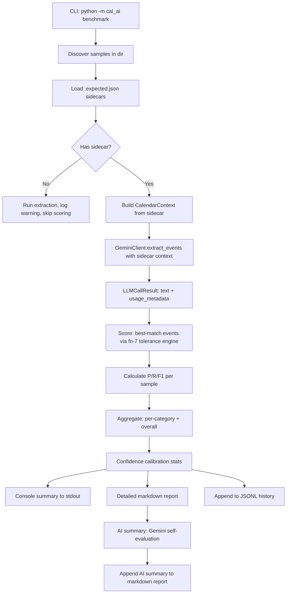

# Benchmark Suite: Precision/Recall Scoring with AI-Summarized Reports

## Overview

Build a CLI benchmark tool (`python -m cal_ai benchmark`) that scores the AI extraction pipeline across all fn-7 regression samples using Precision/Recall/F1 metrics. Produces console summaries, detailed markdown reports with per-sample diffs, confidence calibration stats, latency/cost tracking, run history, and an AI-generated summary where Gemini reasons about its own performance.

## Scope

**In scope:**
- Modify `GeminiClient._call_api()` to surface `response.usage_metadata` (token counts)
- Convert `__main__.py` CLI to argparse subparsers (`run` + `benchmark`) with backward compatibility
- Build scoring engine: P/R/F1, confidence calibration, event matching (reuses fn-7 tolerance engine)
- Build benchmark runner: sample discovery, live Gemini extraction, report generation
- Console summary + detailed markdown report + JSONL history file
- AI-generated summary (Gemini self-evaluation of benchmark results)
- Progress indicator during benchmark execution
- Add `reports/` to `.gitignore`, `make benchmark` Makefile target
- Update README.md, CLAUDE.md

**Out of scope:**
- Mock mode for benchmark (benchmarking requires real LLM output)
- Side-by-side run comparison (future enhancement)
- Cost confirmation prompts
- Precision/recall dashboards or visualization

## Key Design Decisions

1. **Call `extract_events()` directly, NOT `run_pipeline()`**: The benchmark measures extraction accuracy, not calendar sync. Calling `extract_events()` avoids needing Google Calendar OAuth credentials, allows injecting sidecar `calendar_context` for reproducible scoring, and avoids accidental calendar mutations. The sidecar provides `owner`, `reference_datetime`, and `calendar_context` — all passed to `extract_events()`.

2. **Token usage surfacing**: Modify `_call_api()` to return a small dataclass `LLMCallResult(text: str, usage: UsageMetadata | None)` instead of bare `str`. Update `extract_events()` to pass through and accumulate token counts. This is a cross-cutting change that affects `test_llm.py` mocks.

3. **CLI backward compatibility**: Use `argparse.add_subparsers()` with `default` subparser routing. `python -m cal_ai file.txt` continues to work by defaulting to the `run` subcommand. `python -m cal_ai benchmark [dir]` invokes the benchmark. All existing CLI tests must pass after migration.

4. **True Positive definition**: An actual event paired by the fn-7 best-match algorithm where action matches AND all scored fields (title, start_time, end_time) fall within the sidecar's declared tolerance level. This reuses fn-7's tolerance engine directly.

5. **P/R edge cases**: When both actual and expected are empty (e.g., `no_events.txt`), P=1.0, R=1.0, F1=1.0 (vacuous truth). When actual is empty but expected is not, P=1.0 (no false positives), R=0.0. When expected is empty but actual is not, P=0.0, R=1.0 (no missed events).

6. **Category determination**: Derived from subdirectory name (e.g., `samples/crud/` → category `crud`). If a custom flat directory is used, category defaults to `"uncategorized"`.

7. **History format: JSONL** (not JSON array): Eliminates concurrent-write corruption risk, O(1) append, no need to parse entire file. File: `reports/benchmark_history.jsonl`.

8. **`reference_datetime` in live mode**: Use sidecar's `reference_datetime` for reproducible scoring. Live mode tests extraction accuracy against known ground truth, not time resolution.

9. **Gemini pricing**: Hardcode current Gemini 2.5 Pro pricing ($1.25/1M input, $10.00/1M output for ≤200k context) as constants. Cost estimation is approximate — the AI summary call's cost is included in the total.

10. **Progress indicator**: Print `[N/M] category/sample_name... P=0.91 R=0.87 (2.3s)` per sample to stderr, keeping stdout clean for the final summary.

## Architecture & Data Flow



## Risks & Mitigations

| Risk | Impact | Mitigation |
|------|--------|------------|
| fn-7 not complete | Benchmark cannot run | fn-8 depends_on fn-7; implement fn-7 first |
| `_call_api()` change breaks mocks | Test failures | Update all mocks in test_llm.py atomically in same task |
| CLI subparser breaks existing tests | 7 CLI tests fail | Preserve `python -m cal_ai file.txt` via default subparser |
| Gemini rate limiting (15 RPM free tier) | Benchmark hangs or errors | Add configurable delay between samples; Gemini SDK has retry logic |
| Report filename collision (same minute) | Overwrite | Include seconds in filename: `benchmark_YYYY-MM-DDTHH-MM-SS.md` |
| AI summary call fails after 45+ calls | No summary | Graceful degradation: write report without summary, add note |
| Token counts unavailable (older SDK) | Cost tracking broken | Guard with `hasattr(response, 'usage_metadata')`, default to None |

## Quick commands

```bash
# Run benchmark against built-in samples
python -m cal_ai benchmark

# Run benchmark against custom directory
python -m cal_ai benchmark /path/to/samples/ --output /tmp/reports/

# Run existing pipeline (backward compatible)
python -m cal_ai samples/crud/simple_lunch.txt

# Make target
make benchmark
```

## Acceptance

- [ ] `python -m cal_ai benchmark` subcommand discovers samples and runs live extraction
- [ ] `python -m cal_ai file.txt` still works (backward compatible)
- [ ] `GeminiClient._call_api()` returns token usage metadata
- [ ] P/R/F1 calculated per sample and aggregate with correct edge case handling
- [ ] Per-category breakdown in console and markdown report
- [ ] Confidence calibration stats (high/medium/low accuracy correlation)
- [ ] Latency per sample tracked, cost estimated from token counts
- [ ] JSONL history appended per run to `reports/benchmark_history.jsonl`
- [ ] AI-generated summary at end of markdown report (graceful failure)
- [ ] Progress indicator on stderr during execution
- [ ] Samples without sidecars: extracted, warned, excluded from scoring
- [ ] `reports/` in `.gitignore`, `make benchmark` in Makefile
- [ ] ruff clean, all existing tests pass
- [ ] README.md and CLAUDE.md updated

## References

- Existing CLI: `src/cal_ai/__main__.py:25-59` (flat argparse)
- LLM client: `src/cal_ai/llm.py:198-208` (`_call_api()` discards usage_metadata)
- Pipeline entry: `src/cal_ai/pipeline.py:116` (`run_pipeline()`)
- Extraction models: `src/cal_ai/models/extraction.py`
- Calendar context: `src/cal_ai/calendar/context.py` (`CalendarContext`)
- Report pattern: `src/cal_ai/demo_output.py:32-58` (`format_pipeline_result()`)
- CLI tests: `tests/unit/test_cli.py` (7 tests)
- LLM mocks: `tests/unit/test_llm.py:51-63` (`_mock_client()`)
- fn-7 sidecar schema: `.flow/tasks/fn-7-1hq.2.md`
- fn-7 tolerance engine: `.flow/tasks/fn-7-1hq.2.md`
- Gemini pricing: $1.25/1M input, $10.00/1M output (≤200k context)
- Gemini usage_metadata fields: `prompt_token_count`, `candidates_token_count`, `total_token_count`, `thoughts_token_count`
