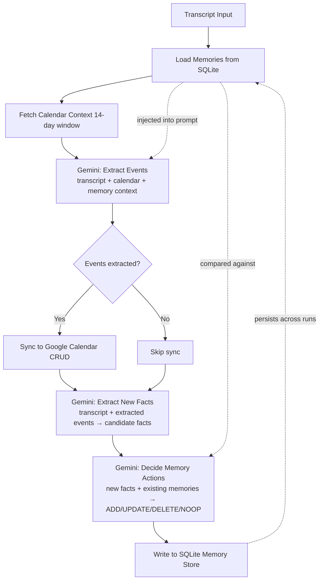

# Long-Term Memory System

## Overview

Add persistent memory to the calendar AI pipeline using a **dual-call architecture**. The main extraction LLM is augmented with memory context (read path), and separate post-processing LLM calls extract new memories from each interaction (write path). Storage uses SQLite (stdlib) with no external dependencies.

The system serves as a **memory prosthetic** — remembering scheduling-relevant facts about the owner and the people they interact with, enabling the AI to make better calendar decisions over time.

**Design docs:** `docs/memory_system_design.tex` (detailed design), `docs/memory_architectures.tex` (comparative analysis of approaches A/B/C — chose Approach A: Dual-Call Pipeline).

### Pipeline Integration



### Key Design Decisions

1. **Two-call write path** (not collapsed single-call): Fact extraction and action decision are separate LLM calls. Produces more observable AI reasoning (demo requirement), easier to test independently.
2. **Full injection, no embeddings**: At single-user scale (<100 memories, ~2K tokens), full injection into the prompt is simpler and more reliable than embedding-based retrieval. Well under Gemini's 1M-token window.
3. **SQLite-only storage**: No vector DB, no external dependencies. `sqlite3` is in Python's stdlib.
4. **UPSERT as the primary write primitive**: A single `upsert(category, key, value, confidence)` method handles both ADD and UPDATE actions. Uses `INSERT ... ON CONFLICT(category, key) DO UPDATE` to preserve row identity, increment `source_count`, and update `updated_at`. A separate `delete(memory_id)` handles DELETE. This avoids the ambiguity of separate `add()`/`update()` methods with conflicting UPSERT semantics.
5. **No FK constraint on `memory_log.memory_id`**: The `memory_id` column is a historical reference, not an enforced FK. This ensures deleting a memory never cascades to (or is blocked by) its audit trail. The log stores `category` and `key` snapshots alongside `memory_id` for durable traceability even after deletion.
6. **Graceful degradation**: Read path failure → continue without memory (matches calendar context pattern). Write path failure → log warning, pipeline returns success (events were synced).
7. **Empty memory = omit section**: When no memories exist, the `## Your Memory` prompt section is not emitted at all. `build_system_prompt()` output must be byte-for-byte identical to current behavior when `memory_context=""`. This preserves backward compatibility with existing regression tests and benchmarks.
8. **Integer ID remapping**: Memory IDs exposed to the LLM in the action decision prompt use remapped integers (starting at 1), not raw DB autoincrement IDs. Same pattern as calendar context integer remapping.
9. **Prompt ordering**: Memory section placed **before** calendar section (both near end of system prompt). Memory is persistent background context; calendar is per-run actionable context that benefits most from recency.
10. **DB initialization**: `CREATE TABLE IF NOT EXISTS` on first `MemoryStore` instantiation — no separate init command. Parent directories created automatically (`Path(db_path).parent.mkdir(parents=True, exist_ok=True)`).
11. **Docker persistence**: Mount a **directory** (not a single file) for the memory DB, so SQLite WAL sibling files (`-wal`, `-shm`) persist together. `MEMORY_DB_PATH` points inside the mounted directory (e.g., `/app/data/memory.db`).
12. **Test databases**: Unit tests must use `tmp_path / "memory.db"` (file-based), not `:memory:`, because WAL mode is not meaningful for in-memory databases.
13. **Write path runs regardless of extraction results**: The memory write path (fact extraction + action decision) runs even when zero calendar events are extracted. Conversations with no scheduling content can still contain valuable memory facts (preferences, people, vocabulary). The write path receives `extracted_events=[]` in this case.
14. **Dry-run skips memory writes**: When `dry_run=True`, the memory write path is skipped entirely (no LLM calls, no SQLite writes). The read path still runs (memories are still loaded and injected into the extraction prompt) since it has no side effects. This matches existing dry-run semantics where no external side effects occur.
15. **Formatter accepts a simple protocol, not full MemoryRecord**: `format_memory_context()` accepts objects with `category`, `key`, and `value` attributes (duck-typed or via a Protocol/NamedTuple). This allows both `MemoryRecord` (from store) and `SidecarMemoryEntry` (from tests) to be formatted without conversion. The formatter does not need `id`, `source_count`, `created_at`, or `updated_at`.
16. **Per-owner memory isolation via separate DB files**: Each owner gets their own SQLite DB file, auto-generated from a slugified `OWNER_NAME` (e.g., `data/memory_alice_smith.db`). Slugification: lowercase, replace spaces/special chars with underscores. If `MEMORY_DB_PATH` is explicitly set in `.env`, it overrides the auto-generated path. This ensures changing `OWNER_NAME` gives a clean memory slate without manual DB management.
17. **Owner name threaded into memory prompts**: The memory section header includes the owner name (e.g., `## Your Memory (about Alice)`). The fact extraction prompt receives the owner name to ensure consistent third-person framing (e.g., "Bob is Alice's manager", not "Bob is the manager" or "Bob is my manager").
18. **Owner-centric people relationships**: The "people" category remembers how other people relate to the owner — roles, meeting patterns, scheduling preferences. Inter-person relationships (e.g., "Bob and Carol are on the same team") are not extracted unless they directly affect the owner's scheduling.
19. **Name collision via LLM disambiguating keys**: When the owner knows two people with the same name, the extraction LLM appends a disambiguating qualifier to the key (e.g., "Bob (manager)" vs "Bob (dentist)"). The extraction prompt should instruct this behavior.
20. **Category is immutable on UPDATE**: The action decision LLM cannot reclassify a memory's category. To change category, it must DELETE the old entry and ADD a new one. This keeps the `UNIQUE(category, key)` constraint stable.
21. **Action reasoning required**: The action decision output schema includes a `reasoning` field explaining why each action was chosen. Supports the demo requirement for observable AI reasoning.
22. **Confidence adjustable by action decision**: The extraction LLM proposes initial confidence, but the action decision LLM sets the final confidence stored in the DB. It has more context (existing memories) and can upgrade/downgrade confidence based on corroboration or contradiction.
23. **UPDATE with temporal context for past-tense references**: When the owner says "Bob used to be my manager", the system should UPDATE the memory to "Bob was Alice's former manager" rather than DELETE. Preserves relationship history while marking it as no longer current.
24. **Conservative sarcasm/hypothetical guard**: Only extract facts stated clearly and directly. Sarcastic or hypothetical statements are skipped. Include 2-3 negative few-shot examples in the extraction prompt (trivial conversations → empty facts array).
25. **Vocabulary includes title preferences**: The vocabulary category captures the owner's preferred event titles (e.g., "wellness hour" = therapy appointment), not just temporal concepts like durations and times.
26. **Console summary of memory operations**: After the write path completes, print a concise one-line summary to console (e.g., "Memory: +2 added, 1 updated, 0 deleted"). Matches the style of sync result logging.
27. **Memory CLI command**: `python -m cal_ai memory` subcommand displays all current memories in a formatted table grouped by category. Shows key/value/confidence/source_count. Part of V1 scope.

### SQLite Schema

```sql
CREATE TABLE memories (
    id           INTEGER PRIMARY KEY AUTOINCREMENT,
    category     TEXT NOT NULL,        -- preferences | people | vocabulary | patterns | corrections
    key          TEXT NOT NULL,        -- lookup identifier
    value        TEXT NOT NULL,        -- memory content
    confidence   TEXT DEFAULT 'medium', -- low | medium | high
    source_count INTEGER DEFAULT 1,   -- conversations confirming this fact
    created_at   TEXT NOT NULL,        -- ISO 8601
    updated_at   TEXT NOT NULL,        -- ISO 8601
    UNIQUE(category, key)
);

CREATE TABLE memory_log (
    id           INTEGER PRIMARY KEY AUTOINCREMENT,
    memory_id    INTEGER,             -- historical ref to memories.id (NOT an enforced FK)
    category     TEXT,                -- snapshot of memory category at time of action
    key          TEXT,                -- snapshot of memory key at time of action
    action       TEXT NOT NULL,        -- ADD | UPDATE | DELETE | NOOP
    old_value    TEXT,
    new_value    TEXT,
    transcript   TEXT,                -- source transcript filename
    created_at   TEXT NOT NULL
);
```

**Note:** `memory_log.memory_id` is intentionally NOT a foreign key. After a DELETE, the log retains the historical `memory_id`, `category`, and `key` for full audit traceability without FK cascade issues.

### Memory Categories

| Category | Key Example | Value Example |
|----------|-------------|---------------|
| preferences | meeting_time | Alice prefers morning meetings (before 11am) |
| people | Bob (manager) | Alice's manager; weekly 1:1 on Tuesdays |
| people | Bob (dentist) | Alice's dentist; appointments need "Dental Appointment" title |
| vocabulary | quick sync | 15-minute meeting |
| vocabulary | wellness hour | Alice's therapy appointment (preferred title) |
| patterns | lunch_meeting | "lunch meeting" means 12:30pm |
| corrections | standup_duration | Standup is 15 min, not 30 |

### Edge Cases

- **Name collisions**: Two people named "Bob" → LLM appends disambiguating context to key: "Bob (manager)" vs "Bob (dentist)"
- **Past-tense references**: "Bob used to be my manager" → UPDATE to "Bob was Alice's former manager", not DELETE
- **Absent owner**: Owner not a speaker in transcript → extract memories normally (transcripts from meetings the owner wasn't in still contain useful facts)
- **Sarcasm/hypotheticals**: "Oh yeah, I LOVE 6am meetings" → skip (conservative extraction guard with negative few-shot examples)
- **Trivial conversations**: Greetings, weather chat, generic questions → empty facts array (negative few-shot examples)
- **Category reclassification**: LLM wants to move a fact from "vocabulary" to "patterns" → must DELETE old + ADD new (category immutable on UPDATE)
- **No minimum transcript threshold**: Even single-line transcripts run through the write path; the extraction LLM returns empty facts for trivial content

### Cost Impact

~$0.012 additional per pipeline run (two Gemini calls at current model pricing). Total per-run cost roughly doubles but remains negligible in absolute terms.

## Scope

**In scope:**
- SQLite memory store with upsert/delete operations and audit log
- Per-owner DB isolation (slugified OWNER_NAME → separate DB file, MEMORY_DB_PATH override)
- Memory read path: load → format → inject into extraction prompt (with owner name in header)
- Memory write path: fact extraction LLM call → action decision LLM call → SQLite write
- Owner name threaded into extraction and action decision prompts (third-person framing)
- Pydantic models for structured LLM output (fact extraction with confidence, action decision with reasoning and confidence adjustment)
- Graceful degradation on both read and write paths
- Config: `MEMORY_DB_PATH` env var (optional override), auto-generated default from `OWNER_NAME`
- Unit tests for memory store, formatter, extraction
- Update existing pipeline unit tests to mock memory stages
- Pipeline integration with memory operations in PipelineResult
- Console summary line for memory operations
- Memory CLI command: `python -m cal_ai memory` (formatted table by category)
- Documentation updates (CLAUDE.md, .env.example, docker-compose.yml)
- Dry-run support (read path active, write path skipped)
- Conservative extraction with 2-3 negative few-shot examples
- Action reasoning field in decision output schema

**Out of scope (V2):**
- Memory pruning / TTL / decay / cap enforcement
- Memory export / import / seeding CLI
- Memory-specific benchmark samples
- User feedback loop (corrections category inferred from conversation only)
- Embedding-based retrieval (unnecessary at single-user scale)
- Inter-person relationship graph (only owner-centric relationships)
- Privacy signals ("off the record" / "don't remember this")
- Source speaker attribution in memory_log
- Memory query by category filter (CLI shows all memories only)

## Quick commands

```bash
# Run all tests including memory store tests
make test

# Run only memory-related tests
pytest tests/unit/test_memory_store.py -v

# Run regression suite (mock mode — verifies backward compatibility)
pytest tests/regression/ -v

# Run pipeline with memory enabled (requires .env)
python -m cal_ai

# View stored memories
python -m cal_ai memory

# Check memory DB contents directly
sqlite3 data/memory_alice_smith.db "SELECT category, key, value FROM memories ORDER BY category, key"
```

## Acceptance

- [ ] `MemoryStore` class provides `upsert`, `delete`, `load_all`, and `log_action` operations against SQLite
- [ ] `upsert(category, key, value, confidence)` uses `INSERT ... ON CONFLICT(category, key) DO UPDATE`, increments `source_count`, updates `updated_at`
- [ ] `MemoryStore.__init__` creates parent directories and DB file; pipeline works with no pre-existing DB or directory
- [ ] `memory_log` stores `category` and `key` snapshots alongside `memory_id` — no FK constraint enforced
- [ ] Per-owner DB isolation: DB path auto-generated from slugified `OWNER_NAME` (e.g., `data/memory_alice_smith.db`); `MEMORY_DB_PATH` overrides when set
- [ ] Read path: memories loaded from SQLite, formatted by category, injected as `## Your Memory (about {owner_name})` section in system prompt before `## Your Calendar`
- [ ] Read path: empty memory store → `build_system_prompt()` output is byte-for-byte identical to current behavior
- [ ] Read path: SQLite failure → warning logged, pipeline continues without memory (graceful degradation)
- [ ] Write path: runs even when zero events are extracted (receives `extracted_events=[]`)
- [ ] Write path: skipped entirely when `dry_run=True` (no LLM calls, no SQLite writes)
- [ ] Write path: fact extraction LLM call produces candidate facts with category/key/value/confidence; receives owner name for third-person framing
- [ ] Write path: fact extraction prompt includes 2-3 negative few-shot examples (trivial → empty facts)
- [ ] Write path: action decision LLM call compares candidates against existing memories, outputs ADD/UPDATE/DELETE/NOOP with integer-remapped IDs, reasoning, and final confidence
- [ ] Write path: ADD and UPDATE dispatch to `upsert()`, DELETE dispatches to `delete()`
- [ ] Write path: all operations logged to `memory_log` table with old/new values, category/key snapshots, and transcript filename
- [ ] Write path: LLM or SQLite failure → warning logged, pipeline returns success (events were synced)
- [ ] Write path: category is immutable on UPDATE (reclassify via DELETE + ADD)
- [ ] `extract_events()` accepts optional `memory_context: str = ""` parameter (backward compatible)
- [ ] `build_system_prompt()` accepts optional `memory_context: str = ""` parameter (backward compatible)
- [ ] `PipelineResult` includes memory operation summary (memories added/updated/deleted counts) and `memory_usage_metadata` for token tracking
- [ ] Console prints concise memory operation summary after write path completes
- [ ] `Settings` dataclass includes `memory_db_path` with auto-generated default from slugified `OWNER_NAME`, overridable via `MEMORY_DB_PATH` env var
- [ ] `format_memory_context()` accepts objects with `category`/`key`/`value` attributes (duck-typed) — works with both `MemoryRecord` and `SidecarMemoryEntry`
- [ ] `python -m cal_ai memory` CLI command displays current memories in a formatted table grouped by category
- [ ] All existing regression tests pass in mock mode with no changes to sidecar files
- [ ] Existing pipeline unit tests updated to mock memory stages and include `memory_db_path` on mocked settings
- [ ] Memory store unit tests use `tmp_path / "memory.db"` (file-based, not `:memory:`)
- [ ] `.env.example` documents `MEMORY_DB_PATH` as optional override
- [ ] `docker-compose.yml` mounts a directory volume for memory DB + WAL sibling file persistence
- [ ] `CLAUDE.md` updated with memory subpackage in project structure and architecture section

## References

- Design doc: `docs/memory_system_design.tex` (detailed pipeline, schema, prompts, cost analysis)
- Architecture doc: `docs/memory_architectures.tex` (Approach A/B/C comparison, recommendation)
- Mem0 (48K stars): Canonical dual-call pipeline — `github.com/mem0ai/mem0`
- Microsoft Teams memory: Structured output pattern — `github.com/microsoft/teams-agent-accelerator-libs-py`
- Existing calendar context pattern: `src/cal_ai/calendar/context.py` (CalendarContext dataclass)
- Existing structured JSON pattern: `src/cal_ai/models/extraction.py` (Pydantic + response_schema)
- SQLite UPSERT docs: `sqlite.org/lang_upsert.html`
- Gemini structured output: `ai.google.dev/gemini-api/docs/structured-output`
- Gemini key ordering pitfall: Schema keys are alphabetically sorted — name fields so alpha order matches logical order
